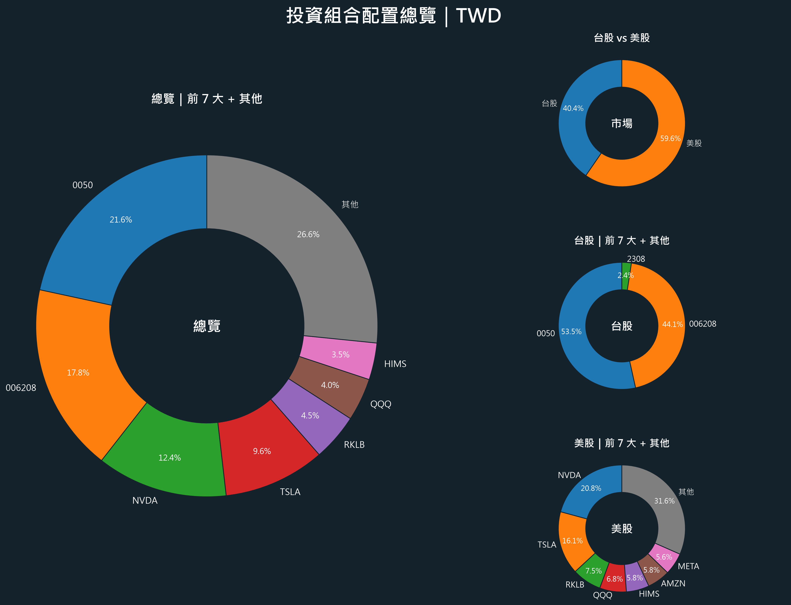

# Personal Portfolio Analyzer

Personal Portfolio Analyzer 是一個用 Streamlit 製作的個人投資組合分析工具。使用者可以上傳持倉 Excel，系統會整理資料、抓取最新股價、將美股換算成台幣，並產生摘要卡片、完整持倉報表、投資組合圖表、類別配置分析與多工作表 Excel 報表。

## 專案截圖



如果 GitHub 上方圖片沒有顯示，請確認 `portfolio_dashboard.png` 已經和 `README.md` 一起 commit 並 push 到 repository，而且檔名大小寫完全一致。

## 主要功能

- 上傳持倉 Excel 檔案（`.xlsx` / `.xls`）
- 自動清理欄位名稱，支援中英文欄位別名
- 使用 `yfinance` 抓取最新股價
- 美股以 USD/TWD 匯率換算成台幣，台股維持台幣
- 可選擇使用 Excel 內的 `price` 欄位作為現價
- 若抓不到股價，會顯示提醒並在報表標示價格狀態
- 摘要卡片顯示總市值、總成本、總損益、總報酬率、最大持股、美股佔比與台股佔比
- 高集中持股提醒，協助檢查單一持股是否過高
- 完整持倉報表，可依持倉比重、報酬率、台幣損益或代號排序
- 持倉報表中的損益與報酬率會用紅綠色標示
- 支援 category 下拉式設定與自訂 category
- 類別配置表與類別配置圓餅圖
- 投資組合 Dashboard 圖與前大持股長條圖
- 下載 Dashboard PNG、長條圖 PNG
- 下載多工作表 Excel 報表
- 下載範例 Excel
- 介面使用 tabs 分頁，讓總覽、持倉、類別與下載功能更清楚

## Excel 欄位格式

上傳的 Excel 工作表需要包含以下欄位：

| 欄位 | 必填 | 說明 | 範例 |
| --- | --- | --- | --- |
| `symbol` | 是 | 股票代號 | `NVDA`, `TSLA`, `0050` |
| `market` | 是 | 市場，只能填 `US` 或 `TW` | `US` |
| `shares` | 是 | 股數 | `10`, `1000` |
| `cost` | 是 | 平均成本 | `150`, `58.72` |
| `category` | 否 | 投資分類，空白會自動補成「未分類」 | `AI基礎建設` |
| `price` | 否 | 手動輸入現價，勾選側邊欄選項後可使用 | `200` |

App 也支援部分中文欄位名稱，例如「代號」、「市場」、「股數」、「平均成本」、「類別」、「現價」。

範例資料：

```csv
symbol,market,category,shares,cost
NVDA,US,AI基礎建設,10,150
AAPL,US,大型科技,5,180
QQQ,US,美股ETF,3,500
0050,TW,台股ETF,1000,180
006208,TW,台股ETF,500,110
```

## 下載報表內容

下載的 Excel 報表包含多個工作表：

- `Holdings`：完整持倉明細，預設依持倉比例由大到小排序
- `Summary`：投資組合摘要指標
- `Market Allocation`：台股 / 美股配置
- `Category Allocation`：category 類別配置
- `Risk Flags`：高集中持股與股價抓取失敗提醒

Excel 內的金額、比例與損益會套用格式：

- 台幣金額顯示為 `NT$#,##0`
- 報酬率與持倉比例顯示為百分比
- 正損益為綠色，負損益為紅色
- 價格抓取失敗列會以淡黃色標示

## 如何在本機執行

1. 安裝 Python 3.10 或以上版本。

2. 安裝套件：

```bash
pip install -r requirements.txt
```

3. 啟動 Streamlit：

```bash
streamlit run app.py
```

4. 在瀏覽器打開 Streamlit 顯示的網址，通常是：

```text
http://localhost:8501
```

## 如何部署到 Streamlit Community Cloud

1. 將專案推到 GitHub repository。
2. 確認 repository 內有以下檔案：
   - `app.py`
   - `requirements.txt`
   - `packages.txt`
   - `README.md`
   - `portfolio_dashboard.png`
3. 到 Streamlit Community Cloud 建立新 app。
4. 選擇你的 GitHub repository。
5. Main file path 設定為 `app.py`。
6. 部署完成後，打開 Streamlit 提供的公開網址。

## 使用技術

- Python
- Streamlit
- pandas
- yfinance
- matplotlib
- openpyxl
- xlsxwriter

## 隱私提醒

不要把真實持股資料放在 public GitHub repository。若要展示作品，建議使用範例資料或自行製作的假資料。

## 常見問題

### GitHub 上的圖片沒有顯示

請確認：

1. 圖片檔案 `portfolio_dashboard.png` 已經 commit 並 push 到 GitHub。
2. 圖片和 `README.md` 位於同一層資料夾。
3. README 裡的路徑是 `./portfolio_dashboard.png`。
4. GitHub 檔名大小寫必須完全一致。

### 上傳 Excel 後顯示缺少必要欄位

請確認工作表中有 `symbol`、`market`、`shares`、`cost` 這四個必要欄位。`category` 可以沒有，系統會自動補成「未分類」。

### market 欄位錯誤

目前只支援：

- `US`：美股
- `TW`：台股

其他市場代碼尚未支援。

### 為什麼某些股票顯示價格抓取失敗？

可能原因包含股票代號錯誤、Yahoo Finance 暫時無法提供資料，或網路連線問題。系統會暫用成本估算市值與損益，並在報表中標示價格狀態。

### 台股代號要怎麼填？

Excel 內只需要填台股代號，例如 `0050`、`2330`。App 會自動轉成 Yahoo Finance 使用的 `.TW` 格式。
